# FLF Scheduling System - Dokumentasi Flowchart

## Ringkasan Eksekutif

Dokumen ini menyajikan visualisasi proses bisnis FLF Scheduling System dalam berbagai format diagram untuk memudahkan pemahaman alur kerja sistem dari pendaftaran buyer hingga perhitungan dispatch/demurrage.

---

## 1. SWIMLANE DIAGRAM (Berdasarkan Peran)

Diagram ini menunjukkan siapa yang melakukan apa, dipisahkan per peran.

```mermaid
graph TB
    subgraph Marketing["👤 MARKETING"]
        M1[📝 Daftar Buyer Baru]
        M2[📋 Buat Kontrak Penjualan]
        M3[💰 Set Laycan & Rates]
    end
    
    subgraph CSC["👤 CSC TEAM"]
        C1[📅 Buat Jadwal Loading]
        C2[🚢 Assign Tongkang]
        C3[⏸️ Catat Idle Time<br/>jika ada]
        C4[📊 Monitor Progress]
    end
    
    subgraph System["🤖 SYSTEM"]
        S1[⚠️ Validasi Laycan]
        S2[🔄 Auto Shift Schedule]
        S3[💵 Hitung Dispatch/<br/>Demurrage]
        S4[📄 Generate Report]
    end
    
    M1 --> M2
    M2 --> M3
    M3 --> C1
    C1 --> S1
    S1 --> C2
    C2 --> C3
    C3 --> S2
    S2 --> C4
    C4 --> S3
    S3 --> S4
    
    style Marketing fill:#dbeafe,stroke:#2563eb,stroke-width:3px
    style CSC fill:#fef3c7,stroke:#f59e0b,stroke-width:3px
    style System fill:#d1fae5,stroke:#10b981,stroke-width:3px
```

---

## 2. LINEAR PROCESS FLOW (Alur Linear Sederhana)

Flowchart paling sederhana: dari awal sampai akhir tanpa cabang kompleks.

---

## 3. TIMELINE VIEW (Tampilan Timeline)

Menunjukkan urutan waktu dari proses bisnis.

---

## 4. DECISION TREE (Pohon Keputusan)

Fokus pada decision points penting dalam sistem.

```mermaid
graph TD
    Start([Mulai Proses]) --> Q1{Buyer sudah<br/>terdaftar?}
    Q1 -->|Belum| A1[Daftar Buyer Baru]
    Q1 -->|Sudah| A2[Buat Contract]
    A1 --> A2
    
    A2 --> Q2{Contract<br/>valid?}
    Q2 -->|Tidak| A2
    Q2 -->|Ya| A3[Buat Schedule]
    
    A3 --> Q3{Schedule dalam<br/>Laycan?}
    Q3 -->|Tidak| W1[⚠️ Warning]
    W1 --> Q4{Override?}
    Q4 -->|Tidak| A3
    Q4 -->|Ya| A4
    Q3 -->|Ya| A4[Assign Tongkang]
    
    A4 --> Q5{Ada Idle<br/>Time?}
    Q5 -->|Ya| A5[Catat Idle]
    A5 --> A6[Auto Shift]
    A6 --> A7
    Q5 -->|Tidak| A7[Loading Selesai]
    
    A7 --> Q6{Loading vs<br/>Laycan?}
    Q6 -->|Lebih Cepat| R1[💰 Dispatch]
    Q6 -->|Tepat Waktu| R2[✅ On Time]
    Q6 -->|Terlambat| R3[💸 Demurrage]
    
    R1 --> End([Selesai])
    R2 --> End
    R3 --> End
    
    style Start fill:#4ade80,stroke:#16a34a,stroke-width:3px
    style End fill:#4ade80,stroke:#16a34a,stroke-width:3px
    style R1 fill:#86efac,stroke:#16a34a,stroke-width:2px
    style R3 fill:#fca5a5,stroke:#dc2626,stroke-width:2px
    style W1 fill:#fed7aa,stroke:#ea580c,stroke-width:2px
```

---

## 5. BLOCK DIAGRAM (Diagram Blok Sederhana)

Menunjukkan komponen utama sistem dan hubungannya.

---

## 6. STEP-BY-STEP VISUAL (Langkah demi Langkah)

Paling sederhana: numbered steps dengan icon.

```mermaid
graph TD
    S1["1️⃣<br/>DAFTAR BUYER<br/>━━━━━━━━━━<br/>Marketing input<br/>data buyer"] --> S2["2️⃣<br/>BUAT CONTRACT<br/>━━━━━━━━━━<br/>Marketing buat<br/>kontrak penjualan"]
    
    S2 --> S3["3️⃣<br/>BUAT SCHEDULE<br/>━━━━━━━━━━<br/>CSC jadwalkan<br/>loading"]
    
    S3 --> S4["4️⃣<br/>ASSIGN TONGKANG<br/>━━━━━━━━━━<br/>CSC tambahkan<br/>tongkang"]
    
    S4 --> S5["5️⃣<br/>CATAT IDLE<br/>━━━━━━━━━━<br/>CSC catat downtime<br/>jika ada"]
    
    S5 --> S6["6️⃣<br/>LOADING SELESAI<br/>━━━━━━━━━━<br/>Proses loading<br/>complete"]
    
    S6 --> S7["7️⃣<br/>HITUNG BIAYA<br/>━━━━━━━━━━<br/>System hitung<br/>Dispatch/Demurrage"]
    
    S7 --> S8["8️⃣<br/>GENERATE REPORT<br/>━━━━━━━━━━<br/>System buat<br/>laporan lengkap"]
    
    style S1 fill:#dbeafe,stroke:#2563eb,stroke-width:2px
    style S2 fill:#dbeafe,stroke:#2563eb,stroke-width:2px
    style S3 fill:#fef3c7,stroke:#f59e0b,stroke-width:2px
    style S4 fill:#fef3c7,stroke:#f59e0b,stroke-width:2px
    style S5 fill:#fce7f3,stroke:#ec4899,stroke-width:2px
    style S6 fill:#fef3c7,stroke:#f59e0b,stroke-width:2px
    style S7 fill:#d1fae5,stroke:#10b981,stroke-width:2px
    style S8 fill:#d1fae5,stroke:#10b981,stroke-width:2px
```

---

## 7. ROLE-BASED SIMPLE FLOW

Flowchart berdasarkan peran, sangat sederhana.

```mermaid
graph LR
    subgraph M["👤 MARKETING"]
        M1[Buyer] --> M2[Contract]
    end
    
    subgraph C["👤 CSC"]
        C1[Schedule] --> C2[Tongkang] --> C3[Idle] --> C4[Monitor]
    end
    
    subgraph S["🤖 SYSTEM"]
        S1[Validasi] --> S2[Auto Shift] --> S3[Kalkulasi] --> S4[Report]
    end
    
    M2 --> C1
    C2 -.-> S1
    C3 -.-> S2
    C4 -.-> S3
    
    style M fill:#dbeafe,stroke:#2563eb,stroke-width:3px
    style C fill:#fef3c7,stroke:#f59e0b,stroke-width:3px
    style S fill:#d1fae5,stroke:#10b981,stroke-width:3px
```

---

## Kesimpulan

Dokumen ini menyediakan 7 perspektif berbeda untuk memahami FLF Scheduling System, mulai dari swimlane diagram yang menunjukkan pembagian peran, hingga role-based flow yang merangkum interaksi antar komponen sistem. Setiap diagram dirancang untuk memberikan pemahaman yang komprehensif tentang proses bisnis dari sudut pandang yang berbeda.
