# FLF Scheduling System - Business Process Flowchart

## Flowchart Sistem

Sistem FLF Scheduling adalah sistem untuk mengelola proses penjualan dan pengiriman batubara dari Turangga Resources kepada buyer. Proses dimulai dari pendaftaran buyer, pembuatan kontrak penjualan, penjadwalan loading batubara menggunakan FLF (Floating Loading Facility), pengelolaan waktu idle (downtime), hingga perhitungan biaya dispatch/demurrage.

---

## 1. COMPLETE BUSINESS PROCESS FLOW (End-to-End)

```mermaid
flowchart TD
    Start([🚀 MULAI PROSES BISNIS]) --> Step1[📋 FASE 1: SALES MANAGEMENT]
    
    Step1 --> CreateBuyer[1️⃣ Create Buyer<br/>Daftarkan data buyer/pelanggan]
    CreateBuyer --> BuyerSaved{Buyer<br/>tersimpan?}
    BuyerSaved -->|❌ Gagal| CreateBuyer
    BuyerSaved -->|✅ Berhasil| CreateContract[2️⃣ Create Contract<br/>Buat kontrak penjualan batubara]
    
    CreateContract --> FillContractData[Isi data kontrak:<br/>- Pilih Buyer<br/>- Vessel Name<br/>- Quantity MT<br/>- Loading Rate<br/>- Laycan Start/End<br/>- Dispatch Rate<br/>- Demurrage Rate]
    
    FillContractData --> ContractSaved{Contract<br/>tersimpan?}
    ContractSaved -->|❌ Gagal| CreateContract
    ContractSaved -->|✅ Berhasil| Step2[📅 FASE 2: SCHEDULING]
    
    Step2 --> CreateSchedule[3️⃣ Create Schedule<br/>Buat jadwal loading batubara]
    
    CreateSchedule --> FillScheduleData[Isi data schedule:<br/>- Pilih Contract<br/>- Pilih FLF<br/>- Tanggal & Waktu Loading<br/>- Loading Method<br/>- Point Location]
    
    FillScheduleData --> AddBarges[4️⃣ Assign Barges<br/>Tambahkan tongkang ke schedule]
    
    AddBarges --> FillBargeData[Untuk setiap tongkang:<br/>- Nama Tongkang<br/>- Quantity MT<br/>- ETA Arrival<br/>- Point Location]
    
    FillBargeData --> MoreBarges{Tambah<br/>tongkang lagi?}
    MoreBarges -->|✅ Ya| AddBarges
    MoreBarges -->|❌ Tidak| ScheduleSaved{Schedule<br/>tersimpan?}
    
    ScheduleSaved -->|❌ Gagal| CreateSchedule
    ScheduleSaved -->|✅ Berhasil| CheckLaycan{Cek Laycan<br/>Violation?}
    
    CheckLaycan -->|⚠️ Ada Violation| ShowLaycanWarning[Tampilkan Warning:<br/>Schedule di luar Laycan]
    ShowLaycanWarning --> UserDecision{User<br/>Konfirmasi?}
    UserDecision -->|❌ Batal| CreateSchedule
    UserDecision -->|✅ Lanjut dengan Override| Step3
    
    CheckLaycan -->|✅ Tidak ada Violation| Step3[⏸️ FASE 3: IDLE TIME MANAGEMENT]
    
    Step3 --> MonitorSchedule[Monitor Proses Loading]
    MonitorSchedule --> IdleOccur{Ada Idle Time?<br/>FLF tidak beroperasi}
    
    IdleOccur -->|❌ Tidak ada| ScheduleComplete
    IdleOccur -->|✅ Ya, ada idle| CreateIdle[5️⃣ Create Idle Time<br/>Catat waktu idle FLF]
    
    CreateIdle --> FillIdleData[Isi data idle:<br/>- Pilih FLF<br/>- Start DateTime<br/>- End DateTime<br/>- Reason<br/>- Remarks]
    
    FillIdleData --> ValidateIdle{Validasi<br/>Idle Time}
    
    ValidateIdle -->|❌ Conflict dengan Schedule| ShowIdleError[Tampilkan Error:<br/>Idle bentrok dengan schedule]
    ShowIdleError --> CreateIdle
    
    ValidateIdle -->|⚠️ Laycan Violation| ShowIdleLaycanWarning[Warning: Idle menyebabkan<br/>schedule keluar dari Laycan]
    ShowIdleLaycanWarning --> UserIdleDecision{User<br/>Konfirmasi?}
    UserIdleDecision -->|❌ Batal| CreateIdle
    UserIdleDecision -->|✅ Override Laycan| SaveIdle
    
    ValidateIdle -->|✅ Valid| SaveIdle[Simpan Idle Time]
    
    SaveIdle --> IdleSaved{Idle<br/>tersimpan?}
    IdleSaved -->|❌ Gagal| CreateIdle
    IdleSaved -->|✅ Berhasil| AutoShift[🔄 Auto Shift Schedule<br/>Geser schedule yang terdampak]
    
    AutoShift --> MonitorSchedule
    
    MonitorSchedule --> ScheduleComplete{Schedule<br/>selesai?}
    ScheduleComplete -->|❌ Belum| MonitorSchedule
    ScheduleComplete -->|✅ Selesai| Step4[💰 FASE 4: FINANCIAL CALCULATION]
    
    Step4 --> CalculateActual[6️⃣ Calculate Actual Loading Time<br/>Hitung waktu loading aktual]
    
    CalculateActual --> CompareLaycan{Bandingkan dengan<br/>Laycan Contract}
    
    CompareLaycan -->|⚡ Loading lebih cepat| CalculateDispatch[7️⃣ Calculate DISPATCH<br/>]
    CompareLaycan -->|⏱️ Loading tepat waktu| NoExtraCharge[Tidak ada biaya tambahan]
    CompareLaycan -->|🐌 Loading terlambat| CalculateDemurrage[7️⃣ Calculate DEMURRAGE<br/>]
    
    CalculateDispatch --> DispatchFormula[Formula Dispatch:<br/>Dispatch = Days Saved × Dispatch Rate]
    CalculateDemurrage --> DemurrageFormula[Formula Demurrage:<br/>Demurrage = Days Delay × Demurrage Rate]
    
    DispatchFormula --> GenerateReport
    DemurrageFormula --> GenerateReport
    NoExtraCharge --> GenerateReport
    
    GenerateReport[8️⃣ Generate Report<br/>Buat laporan lengkap]
    
    GenerateReport --> ReportContent[Report berisi:<br/>- Contract Details<br/>- Schedule Timeline<br/>- Idle Time Records<br/>- Actual vs Planned<br/>- Dispatch/Demurrage Amount<br/>- Total Cost/Savings]
    
    ReportContent --> End([✅ PROSES SELESAI])
    
    style Start fill:#4ade80,stroke:#16a34a,stroke-width:3px,color:#000
    style Step1 fill:#60a5fa,stroke:#2563eb,stroke-width:2px,color:#000
    style Step2 fill:#60a5fa,stroke:#2563eb,stroke-width:2px,color:#000
    style Step3 fill:#60a5fa,stroke:#2563eb,stroke-width:2px,color:#000
    style Step4 fill:#60a5fa,stroke:#2563eb,stroke-width:2px,color:#000
    style End fill:#4ade80,stroke:#16a34a,stroke-width:3px,color:#000
    style CalculateDispatch fill:#86efac,stroke:#16a34a,stroke-width:2px,color:#000
    style CalculateDemurrage fill:#fca5a5,stroke:#dc2626,stroke-width:2px,color:#000
```

---

## 2. DETAIL SETIAP FASE

### FASE 1: SALES MANAGEMENT (Manajemen Penjualan)

#### 1.1 Create Buyer (Daftarkan Pelanggan)

```mermaid
flowchart LR
    A[Buka halaman Buyer] --> B[Klik 'Create Buyer']
    B --> C[Isi Form Buyer:<br/>- Buyer Name<br/>- Email<br/>- Phone<br/>- Address]
    C --> D{Validasi}
    D -->|❌ Error| E[Tampilkan error]
    E --> C
    D -->|✅ Valid| F[POST /api/buyers]
    F --> G[Simpan ke database]
    G --> H[✅ Buyer tersimpan]
```

**Penjelasan:** Langkah pertama adalah mendaftarkan buyer (pelanggan) yang akan membeli batubara. Data buyer ini akan digunakan saat membuat contract.

#### 1.2 Create Contract (Buat Kontrak Penjualan)

```mermaid
flowchart TD
    A[Buka halaman Contract] --> B[Klik 'Create Contract']
    B --> C[Pilih Buyer]
    C --> D[Isi Data Contract:<br/>━━━━━━━━━━━━━━━<br/>📋 Vessel Name<br/>⚖️ Quantity MT<br/>⚡ Loading Rate MT/jam<br/>📅 Laycan Start<br/>📅 Laycan End<br/>💵 Dispatch Rate USD/hari<br/>💸 Demurrage Rate USD/hari]
    D --> E{Validasi<br/>Contract}
    E -->|❌ Error| F[Tampilkan error]
    F --> D
    E -->|✅ Valid| G[POST /api/contracts]
    G --> H[Simpan ke database]
    H --> I[✅ Contract tersimpan]
```

**Penjelasan:** 
- **Laycan**: Periode waktu yang disepakati untuk loading batubara
- **Dispatch Rate**: Bonus yang diterima buyer jika loading selesai lebih cepat dari Laycan End
- **Demurrage Rate**: Penalty yang dibayar Turangga jika loading terlambat melewati Laycan End

---

### FASE 2: SCHEDULING (Penjadwalan Loading)

#### 2.1 Create Schedule (Buat Jadwal Loading)

```mermaid
flowchart TD
    A[Buka halaman Schedule] --> B[Klik 'Create Schedule']
    B --> C[Pilih Contract yang sudah dibuat]
    C --> D[Pilih FLF 1-5]
    D --> E[Pilih Loading Method:<br/>- FLF<br/>- Stevedoring<br/>- Jetty]
    E --> F[Set Tanggal & Waktu Loading]
    F --> G[Set Point Location]
    G --> H[✅ Schedule dasar dibuat]
```

**Penjelasan:** Schedule adalah jadwal kapan loading batubara akan dilakukan. Setiap schedule terhubung dengan 1 contract dan menggunakan 1 FLF.

#### 2.2 Assign Barges (Tambahkan Tongkang)

```mermaid
flowchart TD
    A[Schedule sudah dibuat] --> B[Klik 'Add Barge']
    B --> C[Isi Data Tongkang:<br/>━━━━━━━━━━━━━━━<br/>🚢 Nama Tongkang<br/>⚖️ Quantity MT<br/>⏰ ETA Arrival<br/>📍 Point Location]
    C --> D{Validasi<br/>Barge Data}
    D -->|❌ Error| E[Tampilkan error]
    E --> C
    D -->|✅ Valid| F{Tambah<br/>tongkang lagi?}
    F -->|✅ Ya| B
    F -->|❌ Tidak| G[Simpan semua barges]
    G --> H[✅ Barges tersimpan]
```

**Penjelasan:** Setiap schedule bisa memiliki banyak tongkang (barges). Tongkang adalah kapal yang membawa batubara dari stockpile ke FLF di Taboneo.

#### 2.3 Laycan Validation (Validasi Periode Laycan)

```mermaid
flowchart TD
    A[Schedule & Barges sudah diisi] --> B[System cek Laycan]
    B --> C{Schedule dalam<br/>periode Laycan?}
    C -->|✅ Ya, dalam Laycan| D[Simpan schedule]
    D --> E[✅ Schedule berhasil dibuat]
    
    C -->|⚠️ Tidak, di luar Laycan| F[Tampilkan Warning Modal:<br/>━━━━━━━━━━━━━━━<br/>⚠️ LAYCAN VIOLATION<br/>Schedule akan keluar dari<br/>periode Laycan contract]
    F --> G{User<br/>konfirmasi?}
    G -->|❌ Batal| H[Kembali ke form]
    G -->|✅ Override Laycan| D
```

**Penjelasan:** System akan memperingatkan jika schedule yang dibuat berada di luar periode Laycan. User bisa memilih untuk override (tetap lanjut) atau membatalkan.

---

### FASE 3: IDLE TIME MANAGEMENT (Pengelolaan Waktu Idle)

#### 3.1 Create Idle Time (Catat Waktu Idle FLF)

```mermaid
flowchart TD
    A[Monitor proses loading] --> B{Ada waktu<br/>FLF tidak beroperasi?}
    B -->|❌ Tidak ada idle| Z[Lanjut ke proses berikutnya]
    
    B -->|✅ Ya, ada idle| C[Klik 'Create Idle Time']
    C --> D[Pilih FLF yang idle]
    D --> E[Set Start DateTime]
    E --> F[Set End DateTime]
    F --> G[Pilih Reason:<br/>━━━━━━━━━━━━━━━<br/>🌧️ Weather<br/>🔧 Maintenance<br/>⚠️ Breakdown<br/>⏳ Waiting Barge<br/>📝 Other]
    G --> H[Isi Remarks optional]
    H --> I{Validasi<br/>Idle Time}
    
    I -->|❌ Conflict dengan schedule| J[Error: Idle time bentrok<br/>dengan schedule aktif]
    J --> C
    
    I -->|⚠️ Menyebabkan Laycan Violation| K[Warning: Idle akan menggeser<br/>schedule keluar dari Laycan]
    K --> L{User<br/>konfirmasi override?}
    L -->|❌ Batal| C
    L -->|✅ Override| M
    
    I -->|✅ Valid| M[Simpan idle time]
    M --> N[🔄 AUTO SHIFT SCHEDULE<br/>System otomatis menggeser<br/>schedule yang terdampak]
    N --> O[Update ETA semua<br/>schedule setelahnya]
    O --> P[✅ Idle time tersimpan]
```

**Penjelasan:** 
- **Idle Time**: Waktu dimana FLF tidak beroperasi karena berbagai alasan (cuaca buruk, maintenance, breakdown, dll)
- **Auto Shift**: Ketika idle time ditambahkan, system otomatis menggeser jadwal schedule yang terdampak agar tidak bentrok
- **Laycan Violation**: Jika idle time menyebabkan schedule bergeser keluar dari periode Laycan, user akan diberi warning

---

### FASE 4: FINANCIAL CALCULATION (Perhitungan Biaya)

#### 4.1 Calculate Dispatch/Demurrage

```mermaid
flowchart TD
    A[Schedule selesai loading] --> B[System ambil data:<br/>━━━━━━━━━━━━━━━<br/>📅 Actual Start DateTime<br/>📅 Actual End DateTime<br/>📅 Laycan Start<br/>📅 Laycan End<br/>💵 Dispatch Rate<br/>💸 Demurrage Rate]
    
    B --> C[Hitung Actual Loading Time]
    C --> D{Bandingkan<br/>Actual End vs Laycan End}
    
    D -->|⚡ Actual End < Laycan End| E[DISPATCH<br/>Loading lebih cepat]
    E --> F[Hitung Days Saved:<br/>Days Saved = Laycan End - Actual End]
    F --> G[Hitung Dispatch Amount:<br/>Dispatch = Days Saved × Dispatch Rate]
    
    H --> M
    
    D -->|✅ Actual End = Laycan End| I[ON TIME<br/>Loading tepat waktu]
    I --> J[Tidak ada biaya tambahan]
    J --> M
    
    D -->|🐌 Actual End > Laycan End| K[DEMURRAGE<br/>Loading terlambat]
    K --> L[Hitung Days Delay:<br/>Days Delay = Actual End - Laycan End]
    L --> N[Hitung Demurrage Amount:<br/>Demurrage = Days Delay × Demurrage Rate]
    
    O --> M
    
    M[Generate Report]
    M --> P[Report berisi:<br/>━━━━━━━━━━━━━━━<br/>📋 Contract Details<br/>📅 Schedule Timeline<br/>🚢 Barge Lineup<br/>⏸️ Idle Time Records<br/>📊 Actual vs Planned<br/>💰 Dispatch/Demurrage Amount<br/>💵 Total Cost/Savings]
    P --> Q[✅ PROSES SELESAI]
    
    style E fill:#86efac,stroke:#16a34a,stroke-width:2px
    style K fill:#fca5a5,stroke:#dc2626,stroke-width:2px
    style I fill:#93c5fd,stroke:#2563eb,stroke-width:2px
```

**Penjelasan:**
- **Dispatch**: Bonus yang diterima buyer jika loading selesai lebih cepat dari Laycan End
  - Contoh: Laycan End = 10 Jan, Actual End = 8 Jan → Days Saved = 2 hari
  - Jika Dispatch Rate = $1000/hari → Dispatch Amount = 2 × $1000 = $2000 (buyer dapat bonus)

- **Demurrage**: Penalty yang dibayar Turangga jika loading terlambat melewati Laycan End
  - Contoh: Laycan End = 10 Jan, Actual End = 12 Jan → Days Delay = 2 hari
  - Jika Demurrage Rate = $1500/hari → Demurrage Amount = 2 × $1500 = $3000 (Turangga bayar penalty)

---

## 3. CONTOH SKENARIO LENGKAP

### Skenario: Kontrak dengan PT ABC Coal

### Detail Skenario:

**1. Sales Management (1-2 Jan)**
- 1 Jan: Buat buyer "PT ABC Coal" dengan email, phone, address
- 2 Jan: Buat contract:
  - Vessel: MV OCEAN STAR
  - Quantity: 50,000 MT
  - Loading Rate: 2,000 MT/jam
  - Laycan: 5-10 Jan 2024
  - Dispatch Rate: $1,000/hari
  - Demurrage Rate: $1,500/hari

**2. Scheduling (3 Jan)**
- Buat schedule untuk contract PT ABC
- Pilih FLF-1
- Set tanggal loading: 5 Jan 2024, 08:00
- Tambahkan 3 tongkang:
  - Tongkang A: 20,000 MT, ETA 5 Jan 08:00
  - Tongkang B: 15,000 MT, ETA 5 Jan 14:00
  - Tongkang C: 15,000 MT, ETA 6 Jan 08:00

**3. Operations (5-8 Jan)**
- 5 Jan 08:00: Loading dimulai dengan Tongkang A
- 6 Jan 10:00: Idle time terjadi (cuaca buruk) selama 8 jam
- 6 Jan 18:00: Loading dilanjutkan
- 8 Jan 16:00: Loading selesai (semua 50,000 MT sudah di-load)

**4. Financial Calculation (9 Jan)**
- Laycan End: 10 Jan 2024
- Actual End: 8 Jan 2024
- Days Saved: 2 hari
- **Dispatch Amount: 2 × $1,000 = $2,000** (buyer dapat bonus)

---

## 4. GLOSSARY (Istilah Penting)

| Istilah | Penjelasan |
|---------|------------|
| **Buyer** | Pelanggan yang membeli batubara dari Turangga Resources |
| **Contract** | Kontrak penjualan batubara antara Turangga dan Buyer |
| **FLF** | Floating Loading Facility - fasilitas apung untuk loading batubara (ada 5 unit) |
| **Schedule** | Jadwal loading batubara untuk 1 contract menggunakan 1 FLF |
| **Barge/Tongkang** | Kapal yang membawa batubara dari stockpile ke FLF di Taboneo |
| **Laycan** | Periode waktu yang disepakati untuk loading (Laycan Start - Laycan End) |
| **Dispatch** | Bonus untuk buyer jika loading selesai lebih cepat dari Laycan End |
| **Demurrage** | Penalty untuk Turangga jika loading terlambat melewati Laycan End |
| **Idle Time** | Waktu dimana FLF tidak beroperasi (weather, maintenance, breakdown, dll) |
| **ETA** | Estimated Time of Arrival - perkiraan waktu kedatangan tongkang |
| **Loading Rate** | Kecepatan loading batubara (MT/jam) |
| **MT** | Metric Ton - satuan berat batubara (1 MT = 1,000 kg) |

---

## 5. SUMMARY DIAGRAM (Ringkasan Visual)

```mermaid
graph LR
    A[👤 BUYER] -->|1. Daftar| B[📋 CONTRACT]
    B -->|2. Buat kontrak| C[📅 SCHEDULE]
    C -->|3. Jadwalkan loading| D[🚢 BARGES]
    D -->|4. Assign tongkang| E[⏸️ IDLE TIME]
    E -->|5. Catat downtime| F[💰 CALCULATION]
    F -->|6. Hitung biaya| G[📊 REPORT]
    
    style A fill:#dbeafe,stroke:#2563eb
    style B fill:#fef3c7,stroke:#f59e0b
    style C fill:#fce7f3,stroke:#ec4899
    style D fill:#e0e7ff,stroke:#6366f1
    style E fill:#fed7aa,stroke:#ea580c
    style F fill:#d1fae5,stroke:#10b981
    style G fill:#c7d2fe,stroke:#4f46e5
```

---

**Catatan Penting:**
- Proses ini adalah **sequential** (berurutan) - harus dimulai dari Buyer → Contract → Schedule → Idle (jika ada) → Calculation
- Setiap fase memiliki validasi untuk memastikan data yang diinput benar
- System memberikan warning jika ada Laycan Violation, tapi user bisa override jika diperlukan
- Idle Time bersifat **optional** - hanya dibuat jika memang ada downtime FLF
- Perhitungan Dispatch/Demurrage dilakukan otomatis oleh system setelah loading selesai

